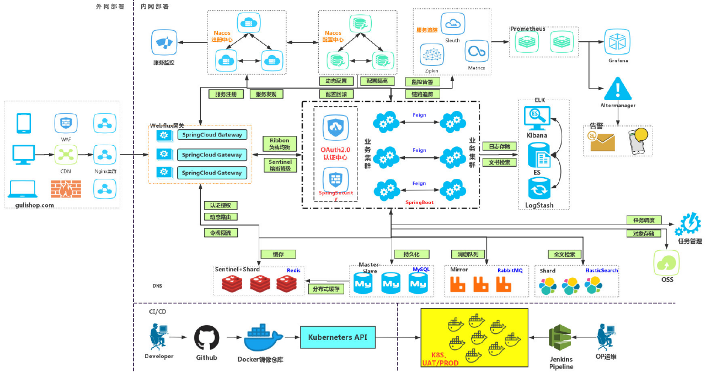

# 企业管理云平台

> System : Windows 10
>
> Intellij IDEA : Ultimate 2020.3.4
>
> Java : 1.8.0_421
>
> MySQL : 8.0.30

#### 介绍
企业管理云平台（Enterprise Cloud Platform,缩写为：ECP）利用现代人工智能算法技术塑造适合中国企业综合管理平台框架、采用云计算SAAS平台利用高速化的互联网传输能力，为软件开发商搭建一个高效、灵活的软件架构；同时根据需求智能分配计算资源，满足中小企业日益增长的信息化管理要求，也为大型集团企业提供高效、安全、稳定的一站式专业级软件应用服务。

#### 软件架构
软件架构说明

	

### 采用开源技术介绍

#### 基础设施参考模型 Reference model
参考模型是指被用于作为基准和对比的模型，在结构化信息标准促进组织的定义中，它被用于理解某些环境中实体之间的重要关系，以及用于开发支持该环境的一般标准或规范框架。

#### 概念

摘要：参考模型被用于提供有关某种环境的信息，以及描述这种环境下可能发生的实体类型或种类，而不是特定环境下实际发生的实体；
实体和关系：参考模型描述两种类型的实体及其关系；
同环境：参考模型不会试图描述「具体事物」，但会阐明「所处环境」或问题空间；
不确定性：参考模型通常被用于促进对问题的理解，而不是具体的解决方案。

##### 应用

创建模型中对象及相互关系的标准，这样可以让软件的制作、软件的扩展更为容易；
教育领域，软件开发领域的领导者可以将问题分解，以加快处理和改进的效率；
改善人与人之间的沟通能力，通过将问题分解为实体或「存在的事物」提升沟通效率；
创建明确的角色和职责，可以提升团队的整体效率；
用于比较不同的东西，在问题分解为基本概念后，可利用参考模型检查不同解决方案。

#### MQTT Abstract:

https://mqtt.org/

MQTT is a Client Server publish/subscribe messaging transport protocol. It is light weight, open,
simple, and designed so as to be easy to implement. These characteristics make it ideal for use
in many situations, including constrained environments such as for communication in Machine to
Machine (M2M) and Internet of Things (IoT) contexts where a small code footprint is required
and/or network bandwidth is at a premium.

#### About FFmpeg

https://ffmpeg.org/

FFmpeg is the leading multimedia framework, able to decode, encode, transcode, mux, demux, stream, filter and play pretty much anything that humans and machines have created. It supports the most obscure ancient formats up to the cutting edge. No matter if they were designed by some standards committee, the community or a corporation. It is also highly portable: FFmpeg compiles, runs, and passes our testing infrastructure FATE across Linux, Mac OS X, Microsoft Windows, the BSDs, Solaris, etc. under a wide variety of build environments, machine architectures, and configurations.

#### OpenCV About

https://opencv.org/

OpenCV (Open Source Computer Vision Library) is an open source computer vision and machine learning software library. OpenCV was built to provide a common infrastructure for computer vision applications and to accelerate the use of machine perception in the commercial products. Being an Apache 2 licensed product, OpenCV makes it easy for businesses to utilize and modify the code.

The library has more than 2500 optimized algorithms, which includes a comprehensive set of both classic and state-of-the-art computer vision and machine learning algorithms. These algorithms can be used to detect and recognize faces, identify objects, classify human actions in videos, track camera movements, track moving objects, extract 3D models of objects, produce 3D point clouds from stereo cameras, stitch images together to produce a high resolution image of an entire scene, find similar images from an image database, remove red eyes from images taken using flash, follow eye movements, recognize scenery and establish markers to overlay it with augmented reality, etc. OpenCV has more than 47 thousand people of user community and estimated number of downloads exceeding 18 million. The library is used extensively in companies, research groups and by governmental bodies.

#### Vosk Recognition 

https://alphacephei.com/vosk/

Vosk is a speech recognition toolkit. The best things in Vosk are:

Supports 20+ languages and dialects - English, Indian English, German, French, Spanish, Portuguese, Chinese, Russian, Turkish, Vietnamese, Italian, Dutch, Catalan, Arabic, Greek, Farsi, Filipino, Ukrainian, Kazakh, Swedish, Japanese, Esperanto, Hindi, Czech, Polish, Uzbek, Korean, Breton, Gujarati, Tajik. More to come.
Works offline, even on lightweight devices - Raspberry Pi, Android, iOS
Installs with simple pip3 install vosk
Portable per-language models are only 50Mb each, but there are much bigger server models available.
Provides streaming API for the best user experience (unlike popular speech-recognition python packages)
There are bindings for different programming languages, too - java/csharp/javascript etc.
Allows quick reconfiguration of vocabulary for best accuracy.
Supports speaker identification beside simple speech recognition.

#### Models

We have two types of models - big and small, small models are ideal for some limited task on mobile applications. They can run on smartphones, Raspberry Pi’s. They are also recommended for desktop applications. Small model typically is around 50Mb in size and requires about 300Mb of memory in runtime. Big models are for the high-accuracy transcription on the server. Big models require up to 16Gb in memory since they apply advanced AI algorithms. Ideally you run them on some high-end servers like i7 or latest AMD Ryzen. On AWS you can take a look on c5a machines and similar machines in other clouds.

Most small model allow dynamic vocabulary reconfiguration. Big models are static the vocabulary can not be modified in runtime.

There are five model sizes, four with English-only versions, offering speed and accuracy tradeoffs. Below are the names of the available models and their approximate memory requirements and inference speed relative to the large model; actual speed may vary depending on many factors including the available hardware.

|  Size  | Parameters | English-only model | Multilingual model | Required VRAM | Relative speed |
|:------:|:----------:|:------------------:|:------------------:|:-------------:|:--------------:|
|  tiny  |    39 M    |     `tiny.en`      |       `tiny`       |     ~1 GB     |      ~32x      |
|  base  |    74 M    |     `base.en`      |       `base`       |     ~1 GB     |      ~16x      |
| small  |   244 M    |     `small.en`     |      `small`       |     ~2 GB     |      ~6x       |
| medium |   769 M    |    `medium.en`     |      `medium`      |     ~5 GB     |      ~2x       |
| large  |   1550 M   |        N/A         |      `large`       |    ~10 GB     |       1x       |

#### About FFmpeg

FFmpeg is the leading multimedia framework, able to decode, encode, transcode, mux, demux, stream, filter and play pretty much anything that humans and machines have created. It supports the most obscure ancient formats up to the cutting edge. No matter if they were designed by some standards committee, the community or a corporation. It is also highly portable: FFmpeg compiles, runs, and passes our testing infrastructure FATE across Linux, Mac OS X, Microsoft Windows, the BSDs, Solaris, etc. under a wide variety of build environments, machine architectures, and configurations.

#### JBoss Rules Engine Drools规则引擎 

Rete算法是利用规则之间各个域的公用部分达到减少规则存储的目的，同时保存匹配过程的临时结果以加快匹配速度。为了达到这种目标，算法将规则进行拆分，将规则中的每个匹配条件，作为基本单位（节点）连接成一个数据辨别网络，然后将事实经过网络筛选并进行传播，最终所有条件都有事实匹配的规则被激活。 

网络节点共有五类节点：Root节点、Type节点、Alpha节点（也称单输入节点）、Beta节点（也称双输入节点）、LeftInputAdapterNode节点、Terminal节点等。 可满足规则，如果一个规则的每一模式均能在当前工作空间中找到可匹配的事实，且模式之间的同一变量能取得统一的约束值，则我们说这个规则是可满足的。所有的可满足规则实例构成的集合称为冲突集，也称为上程表。 产生式规则系统，是常用的知识表示方式之一，它依据人类大脑记忆模式中各种知识之间存在的大量的因果关系，并以“IF-THEN”的形式表示出来的。这种形式的规则捕获了人类求解问题的行为特征，并通过认识->行动的循环过程来求解问题。

Rete算法可以被分为两部分，规则编译和运行执行： 规则编译：指根据规则集合生成推理网络的过程，规则编译的过程描述了如何将规则生成一个高效的鉴别网络(Discrimination Network)，鉴别网络可以理解为用于匹配在其中传递的数据的网络； 运行执行：指将数据送入推理网络进行筛选的过程。

匹配思想：  根据业务人员编写的规则库和工作存空间当前的状态，通过规则模式匹配引擎，把可满足规则放入议程表，将不可满足的规则从议程表中删除。
①. Root节点：根节点，是所有对象进入网络的入口，它可以让所有的事实通过，然后传播给Type节点；
②. Type节点：又叫ObjectType节点，就是我们的Fact，也就是我们规则所用到的POJO，用于选择事实的类型，即针对事实进行类型检查，引擎只让匹配该类型的对象到达后续节点，将符合本节点类型的事实向后继的Alpha节点进行传播，一个Fact对应一个Type节点； 
③. Alpha节点：用于进行同一个对象类型内属性的约束或常量测试，即一个字面条件对应一个Alpha节点，如：age > 10，当有多个字面条件的时候，这些条件链接到一起，即多个Alpha节点连在一起，Alpha节点可以共享； 
④. Beta节点：主要在同一个规则中根据不同对象(pet、cat)之间的约束，进行连接操作，如(“pet.name==cat.name”，“pet.age>cat.age”）。Beta节点又分为Join节点、Not节点等，Join节点包括两种输入，左部输入事实列表，称为元组（Tuple），右部输入一个事实对象，对象与元组在Join节点按照类型间约束进行Join操作，将符合的事实加入到元组中，并继续传入下一个beta节点。Beta节点具有记忆功能，左边的输入被称为Beta Memory，会记住所有到达过的语义，右边的输入成为Alpha Memory，会记住所有到达过的对象，Beta节点不是共享的； 
⑤. LeftInputAdapterNode节点：这个节点的作用是将一个事实对象转化为一个元组，为beta节点提供作用； 
⑥. Terminal节点：这是这条规则的末尾节点，它代表一个规则匹配结束，当事实或元组传递到Terminal节点时，表示该Terminal节点对应的规则已被激活。

#### 安装教程

1.  基于  apache maven deploy 进行自行发布  mvn dependency:tree
2.  xxxx
3.  xxxx

#### 使用说明

1.  xxxx
2.  xxxx
3.  xxxx
基于 Spring cloud
采用  Drools（JBoss Rules Engine) , Activiti Flowable 工作流引擎

#### 参与贡献

1.  Fork 本仓库
2.  新建 Feat_xxx 分支
3.  提交代码
4.  新建 Pull Request

#### 特技

1.  使用 Readme\_XXX.md 来支持不同的语言，例如 Readme\_en.md, Readme\_zh.md
2.  Gitee 官方博客 [blog.gitee.com](https://blog.gitee.com)
3.  你可以 [https://gitee.com/explore](https://gitee.com/explore) 这个地址来了解 Gitee 上的优秀开源项目
4.  [GVP](https://gitee.com/gvp) 全称是 Gitee 最有价值开源项目，是综合评定出的优秀开源项目
5.  Gitee 官方提供的使用手册 [https://gitee.com/help](https://gitee.com/help)
6.  Gitee 封面人物是一档用来展示 Gitee 会员风采的栏目 [https://gitee.com/gitee-stars/](https://gitee.com/gitee-stars/)
