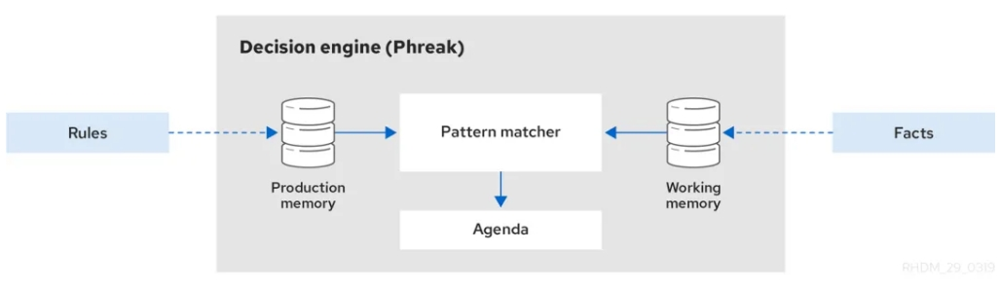
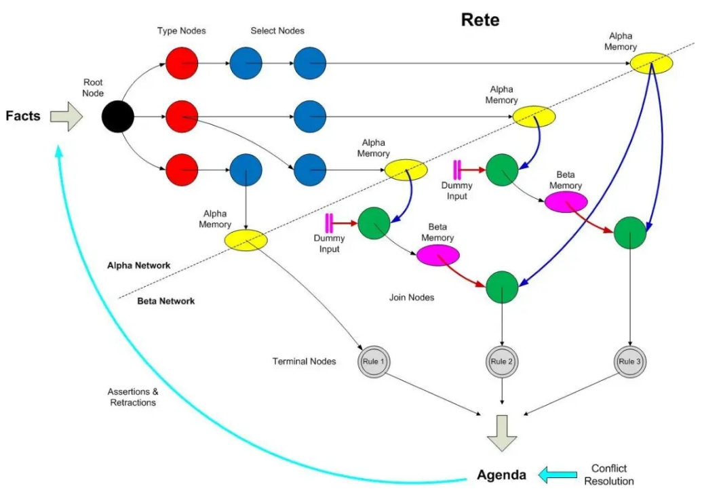

基本概念: 

Rete算法是利用规则之间各个域的公用部分达到减少规则存储的目的，同时保存匹配过程的临时结果以加快匹配速度。为了达到这种目标，算法将规则进行拆分，将规则中的每个匹配条件，作为基本单位（节点）连接成一个数据辨别网络，然后将事实经过网络筛选并进行传播，最终所有条件都有事实匹配的规则被激活。 

网络节点共有五类节点：Root节点、Type节点、Alpha节点（也称单输入节点）、Beta节点（也称双输入节点）、LeftInputAdapterNode节点、Terminal节点等。 可满足规则，如果一个规则的每一模式均能在当前工作空间中找到可匹配的事实，且模式之间的同一变量能取得统一的约束值，则我们说这个规则是可满足的。所有的可满足规则实例构成的集合称为冲突集，也称为上程表。 产生式规则系统，是常用的知识表示方式之一，它依据人类大脑记忆模式中各种知识之间存在的大量的因果关系，并以“IF-THEN”的形式表示出来的。这种形式的规则捕获了人类求解问题的行为特征，并通过认识->行动的循环过程来求解问题。

Rete算法可以被分为两部分，规则编译和运行执行： 规则编译：指根据规则集合生成推理网络的过程，规则编译的过程描述了如何将规则生成一个高效的鉴别网络(Discrimination Network)，鉴别网络可以理解为用于匹配在其中传递的数据的网络； 运行执行：指将数据送入推理网络进行筛选的过程。

匹配思想：

根据业务人员编写的规则库和工作存空间当前的状态，通过规则模式匹配引擎，把可满足规则放入议程表，将不可满足的规则从议程表中删除。

①. Root节点：根节点，是所有对象进入网络的入口，它可以让所有的事实通过，然后传播给Type节点；

②. Type节点：又叫ObjectType节点，就是我们的Fact，也就是我们规则所用到的POJO，用于选择事实的类型，即针对事实进行类型检查，引擎只让匹配该类型的对象到达后续节点，将符合本节点类型的事实向后继的Alpha节点进行传播，一个Fact对应一个Type节点； 

③. Alpha节点：用于进行同一个对象类型内属性的约束或常量测试，即一个字面条件对应一个Alpha节点，如：age > 10，当有多个字面条件的时候，这些条件链接到一起，即多个Alpha节点连在一起，Alpha节点可以共享； 

④. Beta节点：主要在同一个规则中根据不同对象(pet、cat)之间的约束，进行连接操作，如(“pet.name==cat.name”，“pet.age>cat.age”）。Beta节点又分为Join节点、Not节点等，Join节点包括两种输入，左部输入事实列表，称为元组（Tuple），右部输入一个事实对象，对象与元组在Join节点按照类型间约束进行Join操作，将符合的事实加入到元组中，并继续传入下一个beta节点。Beta节点具有记忆功能，左边的输入被称为Beta Memory，会记住所有到达过的语义，右边的输入成为Alpha Memory，会记住所有到达过的对象，Beta节点不是共享的； 

⑤. LeftInputAdapterNode节点：这个节点的作用是将一个事实对象转化为一个元组，为beta节点提供作用； 

⑥. Terminal节点：这是这条规则的末尾节点，它代表一个规则匹配结束，当事实或元组传递到Terminal节点时，表示该Terminal节点对应的规则已被激活。

四. 算法特性：
Rete算法通过共享规则节点和缓存匹配结果，获得产生式推理系统在时间和空间上的性能提升，具备以下特点。 
(1). 状态保存 事实集合中的每次变化，其匹配后的状态都被保存再Alpha和Beta节点中，在下一次事实集合发生变化时，绝大多数的结果都不需要变化，Rete算法通过保存操作过程中的状态，避免了大量的重复计算，Rete算法主要是为那些事实集合变化不大的系统设计的，当每次事实集合的变化非常剧烈时，Rete的状态保存算法效果并不理想。
(2). 节点共享 不同规则之间含有相同的字面条件（相同的模式），从而可以共享同一个节点，Rete网络的各个部分包含各种不同的节点共享，如果某个BetaNode 被 N 条规则共享，则算法在此节点上效率会提高 N 倍。
(3). 节点索引 索引方法是指对Rete网络的节点建立当前节点对后继节点的索引，在事实断言时可以通过索引快速找到对应的后继节点而无需逐个查找，Drools在Rete的面向对象版本ReteOO算法中对ObjectType节点增加后继Alpha节点的索引，以事实的属性为key，Alpha节点为value，这样在事实通过类型节点验证后可以迅速找到对应的Alpha节点进行断言。 同样，对Beta节点也可以建立索引，Beta节点的索引主要是针对节点左右内存的查询。当一个事实传递到Beta节点的右内存中时，需要与该节点的左内存进行连接操作，即遍历左侧内存中的事实元组，找到符合节点约束的事实进行连接。该过程的遍历查找效率较低，将Beta内存分成若干单元，每个单元分配一个id，对右侧的事实用哈希函数求索引，该索引就是某个单元的位置，通过索引快速找到相应单元进行匹配，如果不在该分区，则将该对象组成一个新的单元加入左内存。

五. 算法不足：
(1). 存在状态重复保存的问题，比如匹配过模式1和模式2的事实，要同时保存模式1和模式2的节点到缓存中，将占用较多空间并影响匹配效率。
(2). 事实的删除与事实的添加，执行顺序相同, 除了要执行与事实添加相同的计算外，还需要执行查找，开销很高，Rete的一个主要缺点就是不适合处理快速变化的数据和规则，主要表现在： 数据变化会引起节点保存的临时事实频繁变化，这将让Rete失去增量匹配的优势。 数据的变化使得对规则网络的种种优化方法如索引、条件排序等失去效果。
(3). Rete算法使用了alpha内存存储已计算的中间结果, 以牺牲空间换取时间, 从而加快系统的速度，然而当处理海量数据与规则时，beta内存根据规则的条件与事实的数目而成指数级增长, 所以当规则与事实很多时, 会耗尽系统资源。 
(4). 规则引擎不能处理缺失的数据及模糊的逻辑。例如规则“如果经常熬夜则容易造成老年痴呆”。产生式推理系统将不能精确表达“经常”及“容易”这样的概念，相应的推理也不能得到精确的结果。这种场合下，算法变得很脆弱。

drools workbench

WorkBench是KIE组件中的元素，也称为KIE-WB，是-WB与JBPM-WB的结合体。它是一个可视化的规则编辑器。
WorkBench其实就是一个war包，安装到tomcat中就可以运行。使用WorkBench可以在浏览器中创建数据对象、创建规则文件、创建测试场景并将规则部署到maven仓库供其他应用使用。

https://download.jboss.org/drools/release/7.70.0.Final/
[PARENTDIR]	Parent Directory	 	-	 
[   ]	business-central-7.70.0.Final-wildfly23.war	2022-05-23 07:55	231M	 
[   ]	drools-distribution-7.70.0.Final.zip	2022-05-23 07:55	69M	 
[   ]	droolsjbpm-integration-distribution-7.70.0.Final.zip	2022-05-23 07:55	41M	 
[   ]	kie-server-distribution-7.70.0.Final.zip	2022-05-23 07:55	272M	 